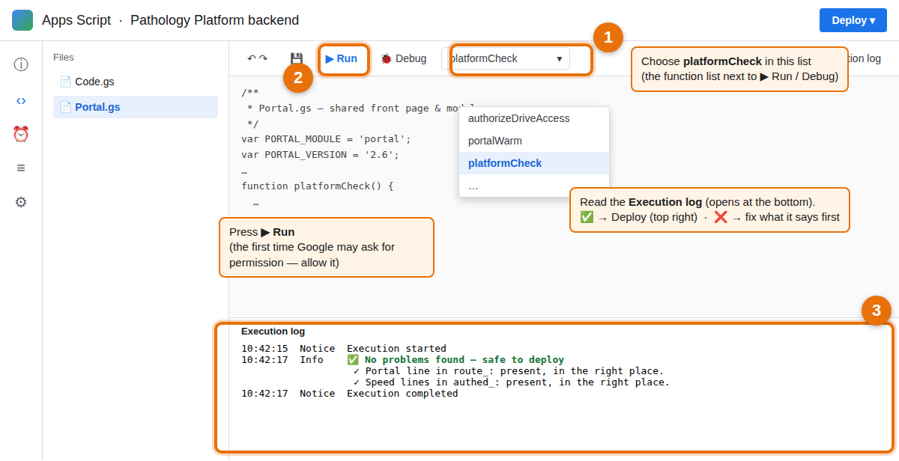

# Setting up the front page

You need: the Apps Script project behind **Cell Injury / Inflammation** (the "main" backend). The front page itself is
this repository on GitHub Pages. The front page starts with two modules: **Cell Injury & Cell Death** and
**Inflammation & Healing** (both *Available*); more can be added later in the Teacher Dashboard.

> **Updating from an earlier version?** Replace the contents of the `Portal` file in Apps Script with the new
> [`backend/Portal.gs`](backend/Portal.gs) (version 2.5 — draft, publish, version history, group local changes with preview, results & attendance overviews, new builds, speed), save, and deploy
> a **new version** (step 1.4). The Code.gs line from step 1.3 stays as it is.

## 1. Main backend (Cell Injury, Inflammation …)

1. Open that Apps Script project (the one whose web-app URL is in `config.js`).
2. **Files → ＋ → Script**, name it `Portal`, paste the whole of [`backend/Portal.gs`](backend/Portal.gs), save.
3. In **Code.gs**, find this line in `route_`:
   ```js
     if (EX_PUBLIC_ACTIONS[action]) return exRoute_(module, p);
   ```
   and add **one line directly below it**:
   ```js
     if (typeof portalHook_ === 'function') { var hp = portalHook_(module, p); if (hp) return hp; }
   ```
   It only handles requests for the front page (module `portal`); every other request continues exactly as before.
4. Save, then **Deploy → Manage deployments → ✏️ Edit → Version: New version → Deploy** (same URL).

## 2. (Later, only if needed) a module on another backend

If you later add a module whose student accounts live on a **different** Apps Script deployment, do steps 1.2–1.4 in
that project too and enter its web-app URL as the module's *Other backend URL* in Teacher Management. (Such a module
opens from the Teacher Dashboard on its own page; direct teacher entry works for modules on the main backend.)

## 3. Turn on GitHub Pages

Repository **Settings → Pages → Deploy from a branch → `main` / `(root)` → Save**. The front page is then at
`https://third-year-med.github.io/Interactive-pathology-platform/`.

## 4. Teacher Sign-In, Teacher Dashboard and the module list

There is **one teacher account** for the whole platform: Platform Home → **Teacher Sign-In** (yellow button, top right).

1. The first time, create the **teacher password** (at least 8 characters).
   *If it says a teacher password already exists:* your main backend still has the old shared teacher password from
   before per-module passwords — sign in with that one.
2. After signing in you are on the **Teacher Dashboard**:
   - **Teaching Modules** — **Open module →** enters the module directly in teacher mode (no module password; it does
     not depend on student accounts and works for modules that are not yet released). **Teacher Portal** opens that
     module's own Teacher Portal (students, content, results, assessments, attendance …).
   - **Teacher Management** — the front-page list (below).
3. Teachers no longer use a module's own teacher password: on the modules' sign-in page the *Teacher* tab, and the
   module's Teacher Portal page, now point to this Teacher Sign-In.
4. **Sign out** (top right) ends the dashboard and the module teacher sessions opened from it.

The module list (Teacher Management):
1. For every module set: **status**, title, subtitle, icon, colour and link. Under **Advanced**:
   - *Backend module key* — the module's key on the backend (`cellinjury`, `inflhealing`, …); student
     access is checked against that module's accounts.
   - *Open students straight in* — **Platform modules** for Cell Injury / Inflammation / later chapters built the same way
     (with their *storage prefix*, e.g. `ci_`, `ih_`); **New-edition sites** for sites that keep a `vp_<key>_session`;
     **No** for any site that should show its own sign-in.
   - *Other backend URL* — only for modules on another Apps Script deployment.
   - *Group links* — the `?g=` groups of this module the teacher wants to open (e.g. `A, B`). The module's card on the
     Teacher Dashboard then gets a **Group link** chooser: pick a group and press **Open module →** or **Teacher Portal**
     to enter that group (its own students, results and attendance) in teacher mode — no group password.
2. **Save changes.** Students see the new list the next time they open or reload the page.

## Platform directory (Admin)

Teacher Dashboard → **Platform directory** (bottom of the page; opens when you click it). It records the structure of the
platform — nothing in it changes sign-in or module access yet (that comes in later steps):

- **Institutions** (e.g. Al-Razi University, Misrata University).
- **Groups** — each belongs to one institution (two universities can both have a "Group A"). Each group has a unique
  **link code** (e.g. `razi-a-26`): its address `…/?g=razi-a-26`. The code is fixed once the group has a delivery.
- **Modules** — one record per subject (filled from the front-page list the first time). A module is never copied.
- **Deliveries** — a module given to a group. Each delivery keeps its own students, results, attendance and assessments
  under its **storage name** `module-linkcode` (e.g. `cellinjury-razi-a-26`), which never changes.
- **Existing data** — a read-only scan of the storage names already in your data (e.g. `cellinjury`, `cellinjury-B`).
  To register existing data: create a group whose link code matches the part after "-" (e.g. `B`) and deliver the module
  to it; for the normal link (no `?g=`) tick *Use the existing storage of the normal link* when adding the delivery.

### Group front pages

Each active group has its own front page: `https://third-year-med.github.io/Interactive-pathology-platform/?g=<link code>`
(e.g. `?g=razi-a-26`). **To get it:** Teacher Dashboard → Platform directory → **Groups** → the group's *Student link*
→ **📋 Copy link** (or **Open ↗** to check it first). It shows the institution, the group and **only that group's modules** (its active deliveries).
Students sign in there if they are **in the group** (Platform directory → **Students**) and have an account in the
group's modules (created automatically from the roster). The link code only selects the group:
changing it never opens another group's modules — the backend checks the account in each delivery's own storage.
"← Back to Platform Home" inside a module opened from a group page returns to that group's page. An unknown or
inactive link shows the main platform page with a notice. Without `?g=` the front page is exactly as before.

### Group students (rosters)

Platform directory → **Students** → choose the group:
- **Add students** — one per line: `Student ID, Name, Email (optional), Password (optional)`. Each student gets one
  account in **every** module of the group, all with the same password. Without a password a temporary one is generated
  and shown **once** (📋 Copy the list); the student chooses their own at first sign-in on the group page, and that new
  password is applied to all the group's modules. A password changed later inside a module also applies to all of them.
- A module delivered to the group later gets the members' accounts automatically (with their current password).
- **Temporary passwords for many students** (one click): for the students who have not chosen their own password yet
  (or all active students), set **one password you type** — the same for all of them, so you can send it any time — or a
  different generated one each. Every student must choose their own password at the next sign-in. The list can be copied
  or downloaded (CSV, with the group link).
- **Reset password** gives a new temporary password for all of the group's modules (type one, or leave empty to generate). **Deactivate** closes all of the
  group's modules for that student at once (nothing is deleted).
- **Add N existing account(s) to this group** — accounts made earlier inside a module's Teacher Portal are not on the
  roster; press this once so those students can sign in on the group page.
- The same Student ID at another university is a different student with separate accounts.
- Students should use their **group link**. If a group student signs in on the main front page instead, the page
  recognises them (only with their correct password) and takes them to their group's page, signed in.
- Adding a student sets the password in every module of the group (also in an account that already existed there), and a
  student added before the group had modules gets their accounts as soon as modules are delivered.

### Teachers (personal accounts)

Platform directory → **Teachers**:
- **Add a teacher** — username (e.g. `dr.ahmed`), name, optional email and password. A temporary password is shown
  **once**; the teacher chooses their own at first sign-in.
- **Assignments** — tick exactly which **group + module** combinations the teacher may manage (e.g. Al-Razi Group A +
  Cell Injury). The same module in another group is a separate tick.
- **Reset password**, **Edit**, **Deactivate** (signed out at once, all their module sessions end).

Teachers sign in on **Teacher Sign-In** with their **username** and password and see only their assigned groups and
modules (with each group's student link). **Open module** / **Teacher Portal** opens that group's module in teacher
mode; the backend checks the assignment every time. Removing an assignment or deactivating a teacher, group,
institution, module or delivery ends the teacher module sessions concerned immediately.
**Administrator:** sign in with the username field **empty** (your existing password) — full access as before.

### Security: module teacher passwords are closed

Since Portal.gs 1.7, nobody can sign in as teacher **inside a module** with a module password, and nobody can create a
new module teacher password ("first-time setup") — teachers use **Teacher Sign-In** with their own account (their
assignments), and the Administrator opens any module from the dashboard. Code.gs is not changed for this.
After installing 1.7, press **Platform directory → Teachers → End all module teacher sessions** once.
Emergency only: Apps Script → Project Settings → Script properties → `ALLOW_MODULE_LOGIN` = `true` restores the old
module sign-in (delete the property to close it again).

### Content: master copy (migration) and versioned content on/off

Platform directory → **Content**, per module (do Cell Injury first, then Inflammation):
1. **📋 Migration report** (read-only): what becomes the master copy (from the main/normal-link storage), what stays with
   each group (assessments, exams), and every item where a group's copy differs from the main one.
2. Choose for each differing item: **Keep for this group only** (default — no group loses anything), **Use the main
   version** (or **Drop** for an item only that group had), or **Use this group's version for everyone**.
3. **Create master v1.0 from this report** — only *copies*; your original content is never changed, and nothing changes
   for students yet. (**Undo migration** removes the copies again, to redo your decisions.)
4. **Switch versioned content ON** — every group of the module receives the master copy plus its own kept items; their
   assessments, exams, results and attendance stay theirs. Teacher edits inside a module stay with that group (editing
   the master copy itself comes in the next step).
5. **Switch OFF** at any time — every group goes back to exactly what it had before (edits made meanwhile are kept and
   return when switched on again). Browsers receive a complete refresh at their next sync after each switch.

**Editing the master copy (Draft → Preview → Publish)** — Content tab, once the master copy exists:
- **✏️ Edit master draft** opens the module (normal link) in teacher mode on the **draft**: a yellow banner says so. Use the
  module's usual editing tools; every change goes into the draft, which only this session shows. Students and all
  groups keep the published version.
- **Changes in draft** lists what was added, changed or removed. **Discard draft** throws the draft changes away.
- **⬆ Publish draft** freezes the draft as a new version (1.1, 1.2, …) with your notes; it is checked after writing, then
  every group receives it at its next sync (their kept items stay on top). Assessments, results and attendance are untouched.
- **Version history** lists every version; **Restore** publishes a copy of an older version as a new version (nothing is
  deleted). **🔒 Freeze publishing** blocks publishing and restoring until unfrozen.
- **🔁 New build** — a rebuilt module (a new packaged `index.html`) goes live without losing the master edits or the
  groups' local changes: preview address (Admin only), compatibility check with a decision per item, then Go live.
  The full procedure and the ID rules are in [docs/REBUILD.md](docs/REBUILD.md).

**Group local changes (additions and hiding per group)** — while versioned content is on, a group's teacher who edits
the module from that group's link changes **only that group**: new topics/questions are local additions, deleting or
hiding a master topic hides it for that group only, and editing a master item gives that group its own version. The
master copy is never modified by a group. Content tab → **Group local changes** lists, per group:
- *Local addition* — only this group has it; it stays when you publish new master versions. **Copy to master draft**
  puts it in the master draft (every group gets it after you publish); **Remove** deletes it for the group.
- *Hidden for this group* — **Show it again** gives the group the master item back.
- *⚠ Changes a master item* — the group sees its own version, so your later corrections of that item do not reach it.
  **Use the master again** removes the group's version; **Copy to master draft** adopts it for everyone.
- *Same as master* — redundant, safe to remove.
- **👁 Preview** on every row shows the item's content right there — pictures with their captions and credits, videos and
  links, a practical's full text, pictures and questions — and, for an item that changes or hides a master item, the
  master version next to it. Preview only reads: nothing is copied or published.

**Changes in draft** and **⬆ Publish draft** warn when an item you changed or removed is changed or hidden locally by a
group. Removing a local item reaches the group at its next sync.

### Results & attendance overviews
- **Admin:** Platform directory → **Results & attendance** — one row per group + module (every delivery).
- **Personal teacher:** Teacher Dashboard → **📊 Results & attendance** — only the group + module combinations assigned to
  that teacher.

Each row shows the group's students, how many have signed in (and in the last 7 days), practice quizzes, assessments,
exams and attendance sessions. **Students →** lists every student of the group with last sign-in, quiz attempts / best /
average, assessments and exams submitted with average, and attendance (sessions attended and %), plus an **attendance
register** (✓ per session) and **⬇ Download (CSV)**. Students are matched to the group's student list by Student ID, then
email, then name; anything that matches nobody (e.g. a name typed differently at attendance check-in) is listed under
"Also found". Each group's data is counted separately. These pages only read the data and never change anything. The
detailed tools (grading, feedback emails, editing attendance) stay inside each module's Teacher Portal.

Records are never deleted (deactivate them instead). The directory uses its own sheets — Institutions, Groups, Modules,
Deliveries, TeacherAssignments, ModuleContentRoles — created on first use; no existing sheet is changed.

## Speed (Portal.gs 2.5)

- **Fast "nothing new" answers.** The frequent background update checks (every 90 s from every open module page) are
  answered from memory when nothing changed, without reading the Content sheet. Any change (a teacher's edit, a
  publish, a switch) still arrives at the next check; the fast answer only skips work, it never hides a change.
- **Which request was it?** Apps Script → **Executions** → click a row → the log shows e.g. `req cellinjury getAllContent`.
- **Keep the script warm (optional, recommended during teaching).** Apps Script → **Triggers** (alarm-clock icon, left)
  → **+ Add Trigger** → function **portalWarm** → deployment **Head** → event source **Time-driven** → type
  **Minutes timer** → **Every 10 minutes** → **Save** (allow the permission prompt). It makes the first request after a
  quiet period less slow. To stop it, delete the trigger.
- **Tidy up.** Platform directory → Content → **🧹 Check what can be tidied** → **Tidy up now**: removes deleted
  edit-history entries, moves older edit-history snapshots (beyond the newest 5 per item) to the sheet
  `ContentArchive`, and deletes expired sign-in sessions. No educational content, student data or results are touched.
- **Faster teacher actions (optional, one small Code.gs addition).** In **Code.gs**, find `function authed_(module, p, fn) {`.
  1. Directly **below** the line `if (!token) return { ok: false, error: 'Not signed in.', code: 'auth' };` add:
     ```js
       var tcache = CacheService.getScriptCache(), tkey = 'tok:' + module + ':' + token;   // speed: checked recently → no sheet read
       if (tcache.get(tkey)) return fn(token);
     ```
  2. In the same function, directly **above** its last line `return fn(token);` add:
     ```js
       tcache.put(tkey, '1', Math.max(60, Math.min(1800, Math.floor((Number(found.expiresAt) - Date.now()) / 1000))));
     ```
  Save and deploy a new version. Teacher saves then no longer read the whole Sessions sheet. It uses the same memory key
  as Code.gs's own Live Classroom check; sign-out, "End all module teacher sessions" and removed assignments still take
  effect immediately (Portal.gs clears the key).
- The module pages poll the Live Classroom less often while a student is on another page (about every 8 s instead of
  3.5 s); inside the Live screen nothing changed.

## Official Exams (Portal.gs 2.6)

The exam app is **https://third-year-med.github.io/pathology-exams/** (repository `pathology-exams`). It uses the same
backend. Students need the **exam access code** at the start of every exam.

**Once:** Teacher Dashboard → **📝 Official Exams** → **➕ Add the Official Exams module**. Then deliver it to a group:
Platform directory → **Deliveries** → group → module **Official Exams** → status *Available*. The group's students get
exam accounts with their usual password automatically (storage `exams-<link code>`).

**Managing exams (no second password):** Teacher Dashboard → 📝 Official Exams → **📝 Manage exams** next to a place:
- 📘 a module's own exams (the Admin: the module's main storage or any group; a personal teacher: their groups);
- 🧩 **Combined exams** of a group (questions from several modules) — the Admin and the teachers assigned to that
  group's *Official Exams* delivery.

**In the exam manager → Exam question bank:**
- **+ Add from a module's teaching question bank** — choose the module and group at the top; tick questions; *Add*.
  Optionally hide them from students' Revision and remove imported ones from the students' bank (Admin on the master
  copy with versioned content ON: this goes into the master draft and reaches students when you publish it).
- **⇆ Copy from another exam bank** — another module, group or combined bank you may use. The copies are independent.
- **🖼 Picture questions (practical)** — choose your own pictures (several at once). Each becomes one question:
  *Short answer* (type the accepted answers separated by `;`) or *Options* (one per line, the first line correct).
  Pictures are made smaller (longest side 2000 px) and stored in the platform's Google Drive folder, never in the sheet.
  A single question can also get a picture: *Edit* → **⬆ Upload picture**.
- **📤 To a teaching bank** — tick questions in the exam bank → choose module, group and a topic per question → *Copy*
  (tick *Move* to remove them from the exam bank). Students can then practise them.

**Giving an exam of the normal link to a group:** students of a group sign in to exams in their group's own place.
On the exam card press **⧉ Copy to a group** → choose the group (e.g. Cell Injury — Razi · Group A) → tick *Publish it
there at once* → **Copy exam**. The exam and its questions are copied there (no duplicates); results are kept per group.

**During a combined exam** (*Close ALL teaching modules of this group for candidates*, on by default) its candidates
cannot open any teaching module of the group, from 15 minutes before opening until closing; other students are not
affected. **Results** of a combined exam show each student's marks **per module** (screen and Excel/CSV).

**Students:** the group page shows an **📝 Official exams** card → *Open the exam page* → the exam (times and state are
shown; never the code) → sign in with the access code, student ID and password.

Drive permission: the first picture upload needs Drive access. If you see "Access denied: DriveApp", open the Apps
Script editor, choose **authorizeDriveAccess** in the function list and press ▶ once.

## Before every Deploy: run the self-check

Apps Script → at the top, choose the function **platformCheck** → **▶ Run** → open the **Execution log**.



- **✅ No problems found** → deploy (Deploy → Manage deployments → Edit → New version → Deploy).
- **❌ …** → it says exactly which line is missing or which key is wrong; fix it, run the check again, then deploy.
It only reads; it changes nothing and never shows a key.

**Never replace Code.gs with a whole new copy** — add only the lines a module needs (STUDENT_AUTH_MODULES,
CONTENT_KEYS, DEFAULT_QUIZ_PW, DEFAULT_LIVE_PW). If something breaks after a deploy: Deploy → Manage deployments →
Edit → Version: the previous one → Deploy, then fix calmly.

## 5. Give students access

Status never opens a module by itself. A student can enter a module when their account exists there:
**Teacher Dashboard → that module's Teacher Portal → Students** (same Student ID; for one sign-in to open several modules the student
needs the **same password** in each — otherwise the card says "Registered — different password" and links to the
module's own sign-in).

## "← Back to Platform Home" inside the modules

Every module shows a return button at the top of its header (all views) and on its sign-in screen. It follows the role
the class server confirmed for the session: students see **← Back to Platform Home** (the student front page);
teachers who opened the module from the Teacher Dashboard see **← Back to Teacher Dashboard**. It is one small shared component in each module's `index.html`:
- `"platformHome": "https://third-year-med.github.io/Interactive-pathology-platform/"` in the module's `NEO_CONFIG`;
- the `<script id="platform-nav">…</script>` block (just before `<script id="neo-data"`), copied unchanged from
  Cell Injury or Inflammation. It also routes teacher access to the single Teacher Sign-In.

## Adding a new module later

1. Build/publish the module as usual (its own site and its key in `STUDENT_AUTH_MODULES` on the backend), including the
   `platformHome` setting and the `platform-nav` block above.
2. Platform Home → Teacher Sign-In → Teacher Management → **＋ Add a module**, fill in the fields, status **Coming soon** or **Completed – not yet
   released**, Save.
3. When teaching starts: create the student accounts in that module, then set its status to **Available**.
